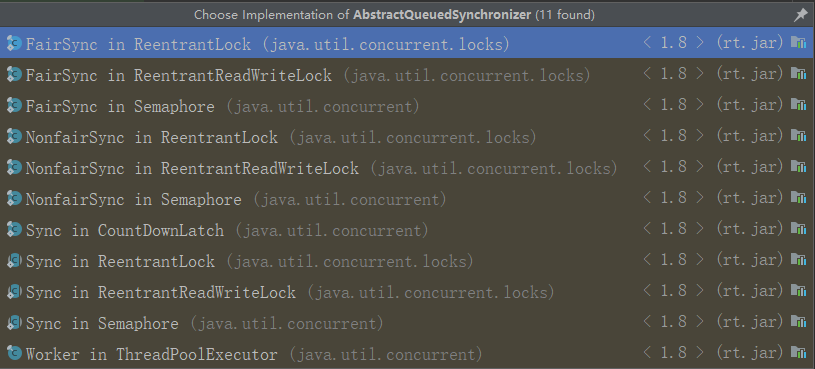

本文介绍两方面的知识：
* CAS: compare and swap
* AQS: AbstractQueuedSynchronizer
# CAS

CAS是compare and swap的缩写，由Unsafe类调用native方法实现。CAS由cpu指令支持，是一个原子操作。

代码实例基于Java 8。

## Unsafe类api

以下仅列出关于CAS的方法。

```java
    //获取实例属性相对于持有它的对象的地址偏移量
    public native long objectFieldOffset(Field var1);
    //获取类属性相对于持有它的对象的地址偏移量
    public native long staticFieldOffset(Field var1);
    
    //获取属性值，以Volatile结尾的方法具有volatile语义
    //获取实例var1地址偏移量var2处的int属性值
    public native int getInt(Object var1, long var2);
    public native int getIntVolatile(Object var1, long var2);
    //获取实例var1地址偏移量var2处的long属性值
    public native long getLong(Object var1, long var2);
    public native long getLongVolatile(Object var1, long var2);
    //获取实例var1地址偏移量var2处的Object属性值
    public native Object getObject(Object var1, long var2);
    public native Object getObjectVolatile(Object var1, long var2);
    
    //cas操作，var1表示要操作的对象，var2表示属性的偏移量，var4表示cas时期望的旧值，var5表示更新的值
    //操作Object类型
    public final native boolean compareAndSwapObject(Object var1, long var2, Object var4, Object var5);
    //操作int类型
    public final native boolean compareAndSwapInt(Object var1, long var2, int var4, int var5);
    //操作long类型
    public final native boolean compareAndSwapLong(Object var1, long var2, long var4, long var6);
    
    //线程操作
    //唤醒
    public native void unpark(Object var1);
    //阻塞
    public native void park(boolean var1, long var2);
```

它还有putXXX的一些方法，这里不再列出。

Unsafe类还实现了一些循环cas的方法，这些方法使用CAS保证对变量的更新是线程安全的。

```java
    public final int getAndAddInt(Object var1, long var2, int var4) {
        int var5;
        do {
            var5 = this.getIntVolatile(var1, var2);
        } while(!this.compareAndSwapInt(var1, var2, var5, var5 + var4));

        return var5;
    }

    public final long getAndAddLong(Object var1, long var2, long var4) {
        long var6;
        do {
            var6 = this.getLongVolatile(var1, var2);
        } while(!this.compareAndSwapLong(var1, var2, var6, var6 + var4));

        return var6;
    }

    public final int getAndSetInt(Object var1, long var2, int var4) {
        int var5;
        do {
            var5 = this.getIntVolatile(var1, var2);
        } while(!this.compareAndSwapInt(var1, var2, var5, var4));

        return var5;
    }

    public final long getAndSetLong(Object var1, long var2, long var4) {
        long var6;
        do {
            var6 = this.getLongVolatile(var1, var2);
        } while(!this.compareAndSwapLong(var1, var2, var6, var4));

        return var6;
    }

    public final Object getAndSetObject(Object var1, long var2, Object var4) {
        Object var5;
        do {
            var5 = this.getObjectVolatile(var1, var2);
        } while(!this.compareAndSwapObject(var1, var2, var5, var4));

        return var5;
    }
```

## Unsafe类实例

一个完整的计数器实例，使用Unsafe类的CAS方法实现了线程安全的递增操作。

```java
    public static class Counter {
        private volatile int value;
        private Unsafe unsafe;
        private long valueOffset;

        public Counter(int value) throws Exception {
            this.value = value;
            Class<?> unsafeClass = Class.forName("sun.misc.Unsafe");
            Field theUnsafeField = unsafeClass.getDeclaredField("theUnsafe");
            theUnsafeField.setAccessible(true);
            unsafe = (Unsafe) theUnsafeField.get(null);
            valueOffset = unsafe.objectFieldOffset(Counter.class.getDeclaredField("value"));
        }

        public int increment() {
            int t;
            do {
                t = unsafe.getIntVolatile(this, valueOffset);
            } while (!unsafe.compareAndSwapInt(this, valueOffset, t, t + 1));
            return t;
        }
    } 
```
   

事实上，实例中的increment方法在Unsafe类中已经有实现了，它等同于

```java
    public int increment() {
        return unsafe.getAndAddInt(this, valueOffset, 1);
    }
```
    
单元测试，可以看到最终打印结果为320

```java
    @Test
    public void testCounter() throws Exception {
        ExecutorService executorService = Executors.newFixedThreadPool(Runtime.getRuntime().availableProcessors() << 1);
        Counter counter = new Counter(0);
        for (int i = 0; i < 320; i++) {
            executorService.execute(() -> {
                int r = counter.increment();
                log.debug("更新前的值：{}", r);
            });
        }
        executorService.shutdown();
        do {
            log.debug("等待任务全部执行");
        } while (!executorService.awaitTermination(2, TimeUnit.SECONDS));

        log.info("最终值：{}", counter.value);
    }
```

## java.util.concurrent.atomic包

这个包下是JDK提供的基于Unsafe类的原子操作类，包括AtomicBoolean、AtomicInteger等，以及下文解决ABA问题的AtomicStampedReference类。

## ABA问题

说到CAS就不得不提的ABA问题。

假设变量的初始值是m。
2. 线程2取到值为A
3. 线程3取到值为A
4. 线程2把值更新为B
5. 线程1取到值为B并把值更新为A
6. 线程3把值更新为X

尽管线程1、2已经对变量值进行了更新，即A-->B-->A的变化，但是3并没有感知到这个值被其他线程修改，所以线程3依然能够更新成功。

这就是所谓的ABA问题。

以下程序模拟了一个ABA问题发生的过程。程序中的value值经历了1-->2-->1-->3的过程。

```java
    @Slf4j
    public class ABATest {
    
        private volatile int value;
        private Unsafe unsafe;
        private long valueOffset;
    
        ABATest(int value) throws Exception {
            this.value = value;
            Class<?> unsafeClass = Class.forName("sun.misc.Unsafe");
            Field theUnsafeField = unsafeClass.getDeclaredField("theUnsafe");
            theUnsafeField.setAccessible(true);
            unsafe = (Unsafe) theUnsafeField.get(null);
            valueOffset = unsafe.objectFieldOffset(UnsafeTest.Counter.class.getDeclaredField("value"));
        }
    
        public static void main(String[] args) throws Exception {
            ////为了模拟ABA问题，使用CountDownLatch变量保证线程1、2、3执行CAS的顺序
            CountDownLatch countDownLatch1 = new CountDownLatch(1);
            CountDownLatch countDownLatch2 = new CountDownLatch(1);
            CountDownLatch countDownLatch3 = new CountDownLatch(1);
    
            ABATest abaTest = new ABATest(1);
            Thread thread2 = new Thread(() -> {
                int v = abaTest.unsafe.getIntVolatile(abaTest, abaTest.valueOffset);
                try {
                    countDownLatch1.await();
                } catch (InterruptedException e) {
                }
                boolean b = abaTest.unsafe.compareAndSwapInt(abaTest, abaTest.valueOffset, v, 2);
                log.info("update: {}, value: {}, {}", b, v, 2);
                countDownLatch3.countDown();
            });
            Thread thread1 = new Thread(() -> {
                try {
                    countDownLatch3.await();
                } catch (InterruptedException e) {
                }
                int v = abaTest.unsafe.getIntVolatile(abaTest, abaTest.valueOffset);
                boolean b = abaTest.unsafe.compareAndSwapInt(abaTest, abaTest.valueOffset, v, 1);
                log.info("update: {}, value: {}, {}", b, v, 1);
                countDownLatch2.countDown();
            });
            Thread thread3 = new Thread(() -> {
                int v = abaTest.unsafe.getIntVolatile(abaTest, abaTest.valueOffset);
                countDownLatch1.countDown();
                try {
                    countDownLatch2.await();
                } catch (InterruptedException e) {
                }
                boolean b = abaTest.unsafe.compareAndSwapInt(abaTest, abaTest.valueOffset, v, 3);
                log.info("update: {}, value: {}, {}", b, v, 3);
            });
    
            thread1.start();
            thread2.start();
            thread3.start();
        }
    }   
```

为了解决这个问题，JKD为我们提供了AtomicMarkableReference、AtomicStampedReference

先来看看AtomicStampedReference的用法。以下代码片段还是实现的int变量的递增操作。

```java
    AtomicStampedReference<Integer> atomicStampedReference = new AtomicStampedReference<>(0, 0);
    int nThreads = Runtime.getRuntime().availableProcessors() << 1;
    ExecutorService executorService = Executors.newFixedThreadPool(nThreads);
    for (int i = 0; i < 320; i++) {
        executorService.execute(() -> {
            int stamp;
            Integer reference;
            do {
                stamp = atomicStampedReference.getStamp();
                reference = atomicStampedReference.getReference();
            } while (!atomicStampedReference.compareAndSet(reference, reference + 1, stamp, stamp + 1));
            log.info("value: {} --->> {}, stamp: {} --->> {}", reference, atomicStampedReference.getReference(), stamp, atomicStampedReference.getStamp());
        });
    }
    executorService.shutdown();
    do {
        log.debug("等待任务全部执行");
    } while (!executorService.awaitTermination(2, TimeUnit.SECONDS));
    log.info("最终结果：value：{}，stamp：{}", atomicStampedReference.getReference(), atomicStampedReference.getStamp());
```
那它是怎么解决ABA问题的？首先来看AtomicStampedReference内部定义的Pair类，如下，它有两个成员，reference代表对象引用，stamp代表对象版本。

```java
    private static class Pair<T> {
        final T reference;
        final int stamp;
        private Pair(T reference, int stamp) {
            this.reference = reference;
            this.stamp = stamp;
        }
        static <T> Pair<T> of(T reference, int stamp) {
            return new Pair<T>(reference, stamp);
        }
    }
```

再看compareAndSet方法的实现，它表明，只有期望引用与当前引用相同、期望版本与当前版本相同、新的引用与当前引用引用不同、新的版本与当前版本不同时，才会执行CAS操作。

1. 期望引用与当前引用不同`or`期望版本与当前版本不同时，说明它已经被更新过了，不能执行CAS操作，返回。
2. 新的引用与当前引用相同`and`新的版本与当前版本相同时，说明它已经是最新的了，不需要执行CAS操作，返回。
3. 1、2
都未短路，则继续执行CAS操作。

```java
    public boolean compareAndSet(V   expectedReference,
                                 V   newReference,
                                 int expectedStamp,
                                 int newStamp) {
        Pair<V> current = pair;
        return
            expectedReference == current.reference &&
            expectedStamp == current.stamp &&
            ((newReference == current.reference &&
              newStamp == current.stamp) ||
             casPair(current, Pair.of(newReference, newStamp)));
    }
    
    private boolean casPair(Pair<V> cmp, Pair<V> val) {
        return UNSAFE.compareAndSwapObject(this, pairOffset, cmp, val);
    }
```

怎么用AtomicStampedReference来解决上面示例程序的ABA问题？如下代码所示，线程3的CAS是不会成功的，也就是说，线程3通过stamp值已经能够感知到变量的变化了。

```java
    //为了模拟ABA问题，使用CountDownLatch变量保证线程1、2、3执行CAS的顺序
    CountDownLatch countDownLatch1 = new CountDownLatch(1);
    CountDownLatch countDownLatch2 = new CountDownLatch(1);
    CountDownLatch countDownLatch3 = new CountDownLatch(1);
    AtomicStampedReference<Integer> atomicStampedReference = new AtomicStampedReference<>(1, 0);

    Thread thread2 = new Thread(() -> {
        Integer v = atomicStampedReference.getReference();
        int stamp = atomicStampedReference.getStamp();
        try {
            countDownLatch1.await();
        } catch (InterruptedException e) {
        }
        boolean b = atomicStampedReference.compareAndSet(v, 2, stamp, stamp + 1);
        log.info("update: {}, value: {}, {}", b, v, 2);
        countDownLatch3.countDown();
    });
    Thread thread1 = new Thread(() -> {
        try {
            countDownLatch3.await();
        } catch (InterruptedException e) {
        }
        Integer v = atomicStampedReference.getReference();
        int stamp = atomicStampedReference.getStamp();
        boolean b = atomicStampedReference.compareAndSet(v, 1, stamp, stamp + 1);
        log.info("update: {}, value: {}, {}", b, v, 1);
        countDownLatch2.countDown();
    });
    Thread thread3 = new Thread(() -> {
        Integer v = atomicStampedReference.getReference();
        int stamp = atomicStampedReference.getStamp();
        countDownLatch1.countDown();
        try {
            countDownLatch2.await();
        } catch (InterruptedException e) {
        }
        boolean b = atomicStampedReference.compareAndSet(v, 3, stamp, stamp + 1);
        log.info("update: {}, value: {}, {}", b, v, 3);
    });

    thread1.start();
    thread2.start();
    thread3.start();
```

AtomicMarkableReference与之类似，不BB它了。

以上就是CAS操作的简单介绍。
下文开始介绍AQS相关知识。

# AQS

AQS就是指的JDK中的AbstractQueuedSynchronizer类了。它使用Unsafe类实现变量的安全更新，是整个juc包构建锁和其他同步设施的基础。

它有以下这些实现类

