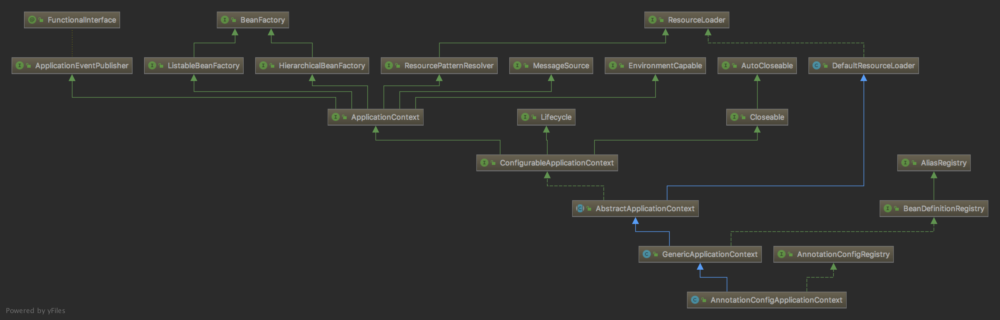
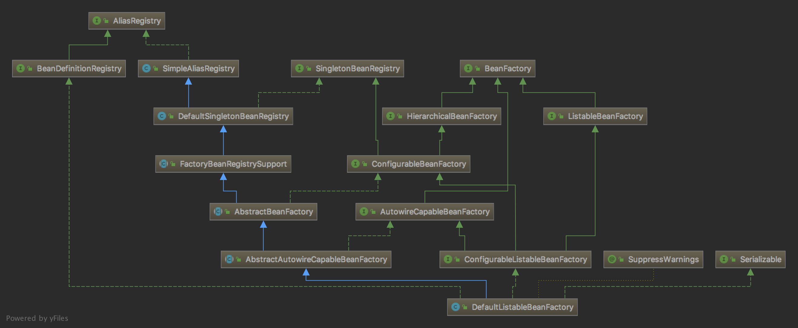

# Spring Boot项目的启动流程

文章主要从以下三个方面来分析Spring Boot项目的启动流程
0. SpringApplication的创建及run方法执行
1. 配置的读取，如application.yml/application.properties等
2. component scan的实现，如常见的注解Service、Component、Autowired等
3. bean的实例化及初始化

AnnotationConfigApplicationContext继承结构



DefaultListableBeanFactory继承结构



一般情况下，创建下面这样一个类，添加Spring Boot的jar包就可以启动一个Spring Boot项目了。我们的分析也将从这里开始。

```java
@SpringBootApplication
public class MainApp {
    public static void main(String[] args) {
        SpringApplication.run(MainApp.class, args);
    }
}
```

## SpringApplication

### 自动配置

@SpringBootApplication

Spring Boot应用启动时，会处理这个注解。

```java
@SpringBootConfiguration
@EnableAutoConfiguration
@ComponentScan(excludeFilters = {
		@Filter(type = FilterType.CUSTOM, classes = TypeExcludeFilter.class),
		@Filter(type = FilterType.CUSTOM, classes = AutoConfigurationExcludeFilter.class) })
public @interface SpringBootApplication {

	/**
	 * 排除自动配置
	 * Exclude specific auto-configuration classes such that they will never be applied.
	 * @return the classes to exclude
	 */
	@AliasFor(annotation = EnableAutoConfiguration.class)
	Class<?>[] exclude() default {};

	/**
	 * 排除自动配置
	 * Exclude specific auto-configuration class names such that they will never be
	 * applied.
	 * @return the class names to exclude
	 * @since 1.3.0
	 */
	@AliasFor(annotation = EnableAutoConfiguration.class)
	String[] excludeName() default {};

	/**
	 * 需要扫描的包 
	 * Base packages to scan for annotated components. Use {@link #scanBasePackageClasses}
	 * for a type-safe alternative to String-based package names.
	 * @return base packages to scan
	 * @since 1.3.0
	 */
	@AliasFor(annotation = ComponentScan.class, attribute = "basePackages")
	String[] scanBasePackages() default {};

	/**
	 * 需要扫描的包
	 * Type-safe alternative to {@link #scanBasePackages} for specifying the packages to
	 * scan for annotated components. The package of each class specified will be scanned.
	 * <p>
	 * Consider creating a special no-op marker class or interface in each package that
	 * serves no purpose other than being referenced by this attribute.
	 * @return base packages to scan
	 * @since 1.3.0
	 */
	@AliasFor(annotation = ComponentScan.class, attribute = "basePackageClasses")
	Class<?>[] scanBasePackageClasses() default {};

}
```

```java
@AutoConfigurationPackage
@Import(AutoConfigurationImportSelector.class)
public @interface EnableAutoConfiguration {

	String ENABLED_OVERRIDE_PROPERTY = "spring.boot.enableautoconfiguration";

	/**
	 * 排除自动配置 
	 * Exclude specific auto-configuration classes such that they will never be applied.
	 * @return the classes to exclude
	 */
	Class<?>[] exclude() default {};

	/**
	 * 排除自动配置
	 * Exclude specific auto-configuration class names such that they will never be
	 * applied.
	 * @return the class names to exclude
	 * @since 1.3.0
	 */
	String[] excludeName() default {};

}
```

```java
@Import(AutoConfigurationPackages.Registrar.class)
public @interface AutoConfigurationPackage {

}

```

```java
public @interface Import {

	/**
	 * {@link Configuration}, {@link ImportSelector}, {@link ImportBeanDefinitionRegistrar}
	 * or regular component classes to import.
	 */
	Class<?>[] value();

}
```

这里使用@Import(AutoConfigurationImportSelector.class)导入了一个类AutoConfigurationImportSelector，这个类是DeferredImportSelector的实现类，也是ImportSelector的实现。

Spring在处理@Import注解时，如果它导入的是ImportSelector实现类，则会调用它的selectImports方法。

AutoConfigurationImportSelector类的selectImports方法从spring.factories文件加载key为org.springframework.boot.autoconfigure.EnableAutoConfiguration的属性，然后将这个属性的值作为配置类进行处理。

自动配置就是这么实现的。

而当@Import的是ImportBeanDefinitionRegistrar实现类时，则会调用它的registerBeanDefinitions方法。

@ComponentScan、@ComponentScans。

### SpringApplication构造器

```java
public SpringApplication(ResourceLoader resourceLoader, Class<?>... primarySources) {
    this.resourceLoader = resourceLoader;
    Assert.notNull(primarySources, "PrimarySources must not be null");
    //为primarySources属性赋值
    this.primarySources = new LinkedHashSet<>(Arrays.asList(primarySources));
    //确定web app的类型，REACTIVE、NONE、SERVLET
    //如果当前classpath下有org.springframework.web.reactive.DispatcherHandler，并且没有org.springframework.web.servlet.DispatcherServlet和org.glassfish.jersey.servlet.ServletContainer，则为REACTIVE
    //如果当前classpath下没有javax.servlet.Servlet或者org.springframework.web.context.ConfigurableWebApplicationContext，则为NONE
    //否则，为SERVLET
    //由于引入了依赖spring-boot-starter-web，所以此处为SERVLET
    this.webApplicationType = WebApplicationType.deduceFromClasspath();
    //从spring.factories加载并实例化所有ApplicationContextInitializer的实现类
    setInitializers((Collection) getSpringFactoriesInstances(ApplicationContextInitializer.class));
    //从spring.factories加载并实例化所有ApplicationListener的实现类
    setListeners((Collection) getSpringFactoriesInstances(ApplicationListener.class));
    //确定调用main方法的那个类，目前是MainApp类
    this.mainApplicationClass = deduceMainApplicationClass();
}
```

#### ApplicationContextInitializer

使用SpringFactoriesLoader从spring.factories中加载的ApplicationContextInitializer实例有以下这些。

```properties
# /spring-boot-2.1.1.RELEASE.jar!/META-INF/spring.factories
# Application Context Initializers
org.springframework.context.ApplicationContextInitializer=\
org.springframework.boot.context.ConfigurationWarningsApplicationContextInitializer,\
org.springframework.boot.context.ContextIdApplicationContextInitializer,\
# 从配置属性context.initializer.classes加载ApplicationContextInitializer实例
org.springframework.boot.context.config.DelegatingApplicationContextInitializer,\
org.springframework.boot.web.context.ServerPortInfoApplicationContextInitializer

# /spring-boot-autoconfigure-2.1.1.RELEASE.jar!/META-INF/spring.factories
# Initializers
org.springframework.context.ApplicationContextInitializer=\
org.springframework.boot.autoconfigure.SharedMetadataReaderFactoryContextInitializer,\
org.springframework.boot.autoconfigure.logging.ConditionEvaluationReportLoggingListener
```

在ConfigurableApplicationContext的refresh方法被调用之前，用于初始化ConfigurableApplicationContext实例的回调接口，这些ApplicationContextInitializer在ConfigurableApplicationContext实例被创建之后执行。

#### ApplicationListener

使用SpringFactoriesLoader从spring.factories中加载的ApplicationListener实例有以下这些。

```properties
# /spring-boot-2.1.1.RELEASE.jar!/META-INF/spring.factories
# Application Listeners
org.springframework.context.ApplicationListener=\
org.springframework.boot.ClearCachesApplicationListener,\
org.springframework.boot.builder.ParentContextCloserApplicationListener,\
org.springframework.boot.context.FileEncodingApplicationListener,\
org.springframework.boot.context.config.AnsiOutputApplicationListener,\
org.springframework.boot.context.config.ConfigFileApplicationListener,\
org.springframework.boot.context.config.DelegatingApplicationListener,\
org.springframework.boot.context.logging.ClasspathLoggingApplicationListener,\
org.springframework.boot.context.logging.LoggingApplicationListener,\
org.springframework.boot.liquibase.LiquibaseServiceLocatorApplicationListener


# /spring-boot-autoconfigure-2.1.1.RELEASE.jar!/META-INF/spring.factories
# Application Listeners
org.springframework.context.ApplicationListener=\
org.springframework.boot.autoconfigure.BackgroundPreinitializer
```

基于java java.util.EventListener接口的观察者模式。用于处理Spring容器中的ApplicationEvent事件。

后面会着重说明ConfigFileApplicationListener类。

**可以自己实现ApplicationContextInitializer、ApplicationListener并将其配置到spring.factories文件中来实现对Spring Boot应用的定制。**

### run方法

这个run方法直指SpringApplication实例的的(String... args)方法。

```java
public ConfigurableApplicationContext run(String... args) {
    StopWatch stopWatch = new StopWatch();
    stopWatch.start();
    ConfigurableApplicationContext context = null;
    Collection<SpringBootExceptionReporter> exceptionReporters = new ArrayList<>();
    configureHeadlessProperty();
    //SpringApplication实例的run方法的监听器。从spring.factories加载并实例化所有SpringApplicationRunListener的实现类
    //目前为止spring.factories中配置的SpringApplicationRunListener的实现只有EventPublishingRunListener，并且也仅有这一个实现类
    SpringApplicationRunListeners listeners = getRunListeners(args);
    //发布ApplicationStartingEvent事件
    //getApplicationListeners(event, type) = {ArrayList@1999}  size = 4
    // 0 = {LoggingApplicationListener@2009} 
    // 1 = {BackgroundPreinitializer@2010} 
    // 2 = {DelegatingApplicationListener@2011}  从配置项context.listener.classes加载并实例化ApplicationListener，然后对当前事件做处理
    // 3 = {LiquibaseServiceLocatorApplicationListener@2012} 
    listeners.starting();
    try {
        ApplicationArguments applicationArguments = new DefaultApplicationArguments(args);
        //创建environment并调用EnvironmentPostProcessor#postProcessEnvironment进行配置文件读取
        //ApplicationEnvironmentPreparedEvent
        ConfigurableEnvironment environment = prepareEnvironment(listeners,applicationArguments);
        configureIgnoreBeanInfo(environment);
        Banner printedBanner = printBanner(environment);
        //根据this.webApplicationType加载并实例化对应的ApplicationContext实现类
        context = createApplicationContext();
        exceptionReporters = getSpringFactoriesInstances(
                SpringBootExceptionReporter.class,
                new Class[] { ConfigurableApplicationContext.class }, context);
        //调用ApplicationContextInitializer#initialize
        //将MainApp注册到BeanFactory
        //发布ApplicationPreparedEvent事件
        prepareContext(context, environment, listeners, applicationArguments, printedBanner);
        //调用AbstractApplicationContext#refresh	
        refreshContext(context);
        //空方法，子类可以充重写来扩展功能
        afterRefresh(context, applicationArguments);
        stopWatch.stop();
        if (this.logStartupInfo) {
            new StartupInfoLogger(this.mainApplicationClass)
                    .logStarted(getApplicationLog(), stopWatch);
        }
        //ApplicationStartedEvent
        //getApplicationListeners(event, type) = {ArrayList@6652}  size = 2
        // 0 = {BackgroundPreinitializer@6657} 
        // 1 = {DelegatingApplicationListener@6658} 
        listeners.started(context);
        //调用ApplicationRunner、CommandLineRunner的run方法
        callRunners(context, applicationArguments);
    }
    catch (Throwable ex) {
        handleRunFailure(context, ex, exceptionReporters, listeners);
        throw new IllegalStateException(ex);
    }

    try {
        //发布ApplicationReadyEvent事件
        //getApplicationListeners(event, type) = {ArrayList@6676}  size = 3
        // 0 = {BackgroundPreinitializer@6667} 
        // 1 = {DelegatingApplicationListener@6546} 
        listeners.running(context);
    }
    catch (Throwable ex) {
        handleRunFailure(context, ex, exceptionReporters, null);
        throw new IllegalStateException(ex);
    }
    return context;
}
```

以下将重点说明该方法的三处代码

* SpringApplicationRunListeners listeners = getRunListeners(args);
* ConfigurableEnvironment environment = prepareEnvironment(listeners, applicationArguments);
* context = createApplicationContext();
* prepareContext(context, environment, listeners, applicationArguments, printedBanner);
* refreshContext(context);
* afterRefresh(context, applicationArguments);
* listeners.started(context);
* callRunners(context, applicationArguments);
* listeners.running(context);

#### SpringApplicationRunListeners listeners = getRunListeners(args);

从spring.factories中加载并实例化接口SpringApplicationRunListener的实现类，如下

```properties
# Run Listeners
org.springframework.boot.SpringApplicationRunListener=\
org.springframework.boot.context.event.EventPublishingRunListener
```
    
目前为止，接口SpringApplicationRunListener的实现类只有一个，就是EventPublishingRunListener。

Spring Boot要求，SpringApplicationRunListener的实现必须有一个接受SpringApplication application, String[] args两个参数的构造器。看EventPublishingRunListener的构造器。

```java
public EventPublishingRunListener(SpringApplication application, String[] args) {
    this.application = application;
    this.args = args;
    this.initialMulticaster = new SimpleApplicationEventMulticaster();
    for (ApplicationListener<?> listener : application.getListeners()) {
        this.initialMulticaster.addApplicationListener(listener);
    }
}
```

在这里，构造SpringApplication时从spring.factories文件加载的ApplicationListener都被添加到EventPublishingRunListener的initialMulticaster属性中去了。

类SimpleApplicationEventMulticaster在refresh时还会用到。它的作用就相当于是一系列ApplicationListener的代理，当有事件发生时，直接发送给ApplicationEventMulticaster就行。

事件都将通过SpringApplicationRunListeners实例来发布。
   * ApplicationStartingEvent、ApplicationEnvironmentPreparedEvent、ApplicationEnvironmentPreparedEvent、ApplicationPreparedEvent事件会借助EventPublishingRunListener来发布。
   * ApplicationStartedEvent、ApplicationReadyEvent事件却是使用ApplicationContext发布。

**可以自己实现SpringApplicationRunListener并将其配置到spring.factories中来实现对SpringApplication的run方法的监听。**

#### ConfigurableEnvironment environment = prepareEnvironment(listeners, applicationArguments);

// TODO

创建并初始化ConfigurableEnvironment实例，之后发布ApplicationEnvironmentPreparedEvent事件来调用相应的ApplicationListener对ConfigurableEnvironment实例做进一步的处理。

```java
private ConfigurableEnvironment prepareEnvironment(
        SpringApplicationRunListeners listeners,
        ApplicationArguments applicationArguments) {
    // Create and configure the environment
    ConfigurableEnvironment environment = getOrCreateEnvironment();
    configureEnvironment(environment, applicationArguments.getSourceArgs());
    //发布ApplicationEnvironmentPreparedEvent事件
    //getApplicationListeners(event, type) = {ArrayList@2170}  size = 7
    // 0 = {ConfigFileApplicationListener@2176} 从spring.factories中加载并实例化EnvironmentPostProcessor，自身也是一个EnvironmentPostProcessor的实现。对这些EnvironmentPostProcessor排序，然后调用EnvironmentPostProcessor#postProcessEnvironment方法。
    // 1 = {AnsiOutputApplicationListener@2177} 
    // 2 = {LoggingApplicationListener@2178} 
    // 3 = {ClasspathLoggingApplicationListener@2179} 
    // 4 = {BackgroundPreinitializer@2180} 
    // 5 = {DelegatingApplicationListener@2181} 
    // 6 = {FileEncodingApplicationListener@2182} 
    listeners.environmentPrepared(environment);
    bindToSpringApplication(environment);
    if (!this.isCustomEnvironment) {
        environment = new EnvironmentConverter(getClassLoader())
                .convertEnvironmentIfNecessary(environment, deduceEnvironmentClass());
    }
    ConfigurationPropertySources.attach(environment);
    return environment;
}
```
	
这里看下org.springframework.boot.context.config.ConfigFileApplicationListener这个类，它处理ApplicationEnvironmentPreparedEvent和ApplicationPreparedEvent两个事件。

ApplicationEnvironmentPreparedEvent事件完成了配置文件的加载

```java
private void onApplicationEnvironmentPreparedEvent(
        ApplicationEnvironmentPreparedEvent event) {
    // 使用SpringFactoriesLoader从spring.factories中加载值为org.springframework.boot.env.EnvironmentPostProcessor的属性并实例化这些类
    List<EnvironmentPostProcessor> postProcessors = loadPostProcessors();
    // this也是EnvironmentPostProcessor的实现
    postProcessors.add(this);
    //对postProcessors排序
    AnnotationAwareOrderComparator.sort(postProcessors);
    //调用这些postProcessors的postProcessEnvironment方法
    for (EnvironmentPostProcessor postProcessor : postProcessors) {
        postProcessor.postProcessEnvironment(event.getEnvironment(),
                event.getSpringApplication());
    }
}
```

它从spring.factories中加载了这些了类的实例
```properties
# Environment Post Processors
org.springframework.boot.env.EnvironmentPostProcessor=\
# 云环境、未配置，不会执行这个类
org.springframework.boot.cloud.CloudFoundryVcapEnvironmentPostProcessor,\
# 处理json格式的配置，
org.springframework.boot.env.SpringApplicationJsonEnvironmentPostProcessor,\
# 处理系统环境变量
org.springframework.boot.env.SystemEnvironmentPropertySourceEnvironmentPostProcessor
```

三者顺序：SpringApplicationJsonEnvironmentPostProcessor、SpringApplicationJsonEnvironmentPostProcessor、ConfigFileApplicationListener

主要看ConfigFileApplicationListener实现的EnvironmentPostProcessor的postProcessEnvironment方法
```java
@Override
public void postProcessEnvironment(ConfigurableEnvironment environment,
        SpringApplication application) {
    addPropertySources(environment, application.getResourceLoader());
}
protected void addPropertySources(ConfigurableEnvironment environment,
        ResourceLoader resourceLoader) {
    RandomValuePropertySource.addToEnvironment(environment);
    new Loader(environment, resourceLoader).load();
}
```

其最关键的是最后一句代码
```java
new Loader(environment, resourceLoader).load();
```
Loader类实现了配置文件的加载。

1. 从spring.factories中加载PropertySourceLoader的实现类并实例化这些类

    ```properties
    # PropertySource Loaders
    org.springframework.boot.env.PropertySourceLoader=\
    org.springframework.boot.env.PropertiesPropertySourceLoader,\
    org.springframework.boot.env.YamlPropertySourceLoader
    ```
    
    这里加载了两个类实例
    * PropertiesPropertySourceLoader：用于加载.properties、.xml扩展名的配置文件
    * YamlPropertySourceLoader：用于加载.yml、.yaml扩展名的配置文件

2. 读取配置文件的位置
    
    如果属性spring.config.location有值，则从该属性的值解析出配置文件的位置
    否则从属性spring.config.additional-location的值解析出的配置文件的位置、 classpath:/,classpath:/config/,file:./,file:./config/作为配置文件的位置

3. 使用PropertySourceLoader实例从上述的位置加载配置

    它将配置文件封装为PropertySource并添加到当前Environment实例的propertySources中。

#### context = createApplicationContext();

这里创建了ApplicationContext实例，其实是AnnotationConfigApplicationContext的实例。
AnnotationConfigApplicationContext的无参构造器及其父类GenericApplicationContext的无参构造器

```java
public AnnotationConfigApplicationContext() {
    this.reader = new AnnotatedBeanDefinitionReader(this);
    this.scanner = new ClassPathBeanDefinitionScanner(this);
}

public GenericApplicationContext() {
    this.beanFactory = new DefaultListableBeanFactory();
}
```

AnnotationConfigApplicationContext的父类GenericApplicationContext持有一个DefaultListableBeanFactory实例。

AnnotationConfigApplicationContext和DefaultListableBeanFactory这两个类都实现了几个相同的接口：
    BeanDefinitionRegistry、HierarchicalBeanFactory、ListableBeanFactory、BeanFactory

`this.scanner = new ClassPathBeanDefinitionScanner(this);`没什么好说的，这个用于扫描classpath下被@Component、@Repository、@Service、@Controller、@ManagedBean、@Named注解的类并注册到beanFactory。
这里看下`this.reader = new AnnotatedBeanDefinitionReader(this);`，以编程的方式完成被注解的类的注册。
跟踪这行代码到`AnnotationConfigUtils.registerAnnotationConfigProcessors(this.registry);`
最终发现这里注册了以下几个bean注册到beanFactory实例。	

| bean name | bean class | 用途 |
|:----|:----|:----|
|org.springframework.context.annotation.internalConfigurationAnnotationProcessor    |ConfigurationClassPostProcessor            |启动时处理@Configuration|
|org.springframework.context.annotation.internalAutowiredAnnotationProcessor        |AutowiredAnnotationBeanPostProcessor       |处理@Autowired、@Value，支持@javax.inject.Inject                              |
|org.springframework.context.annotation.internalCommonAnnotationProcessor           |CommonAnnotationBeanPostProcessor          |处理javax.annotation包下的注解，@PostConstruct、@PreDestroy、@Resource、@WebServiceRef、@EJB  |
|org.springframework.context.event.internalEventListenerProcessor                   |EventListenerMethodProcessor               |处理@EventListener                                               |
|org.springframework.context.event.internalEventListenerFactory                     |DefaultEventListenerFactory                |处理@EventListener                                               |

其中，ConfigurationClassPostProcessor是BeanFactoryPostProcessor的实现，同时也实现了BeanDefinitionRegistryPostProcessor；

AutowiredAnnotationBeanPostProcessor、CommonAnnotationBeanPostProcessor是BeanPostProcessor的实现。

后面refresh时会用到这几个类。

#### prepareContext(context, environment, listeners, applicationArguments, printedBanner);

```java
private void prepareContext(ConfigurableApplicationContext context,
        ConfigurableEnvironment environment, SpringApplicationRunListeners listeners,
        ApplicationArguments applicationArguments, Banner printedBanner) {
    context.setEnvironment(environment);
    postProcessApplicationContext(context);
    //调用ApplicationContextInitializer#initialize
    applyInitializers(context);
    //无用
    listeners.contextPrepared(context);
    if (this.logStartupInfo) {
        logStartupInfo(context.getParent() == null);
        logStartupProfileInfo(context);
    }

    // Add boot specific singleton beans
    // 注册applicationArguments到BeanFactory
    context.getBeanFactory().registerSingleton("springApplicationArguments",
            applicationArguments);
    if (printedBanner != null) {
        context.getBeanFactory().registerSingleton("springBootBanner", printedBanner);
    }

    // Load the sources
    Set<Object> sources = getAllSources();
    Assert.notEmpty(sources, "Sources must not be empty");
    //将MainApp注册到BeanFactory
    //使用BeanDefinitionLoader将MainApp实例添加到BeanFactory
    load(context, sources.toArray(new Object[0]));
    //将SpringApplication中的ApplicationListener实例添加到ApplicationContext中		
    //发布ApplicationPreparedEvent事件
    //getApplicationListeners(event, type) = {ArrayList@4303}  size = 4
    // 0 = {ConfigFileApplicationListener@2176} 
    // 1 = {LoggingApplicationListener@2178} 
    // 2 = {BackgroundPreinitializer@2180} 
    // 3 = {DelegatingApplicationListener@2181} 
    listeners.contextLoaded(context);
}
```

目前为止事件的发布都是使用的EventPublishingRunListener#initialMulticaster来进行的。
后面的事件发布都是用AbstractApplicationContext#applicationEventMulticaster来进行。
实际上，这两个属性是SimpleApplicationEventMulticaster的不同实例。

#### refreshContext(context);

调用了`((AbstractApplicationContext) applicationContext).refresh();`，后面再说这个。

#### afterRefresh(context, applicationArguments);

这个方法没有做任何事情，子类可以重写该方法。

#### listeners.started(context);

发布ApplicationStartedEvent事件

#### callRunners(context, applicationArguments);

在ApplicationStarted之后，调用ApplicationRunner、CommandLineRunner的run方法，用户可以自己实现这两个接口来做一些事情。

#### listeners.running(context);

发布ApplicationReadyEvent事件

## AbstractApplicationContext

refresh方法是在AbstractApplicationContext中实现的。
AnnotationConfigApplicationContext的继承体系，只列出了几个类，接口没有列出。

```java
AnnotationConfigApplicationContext
    GenericApplicationContext
        AbstractApplicationContext
            DefaultResourceLoader
```

看看refresh方法的实现。

```java
public void refresh() throws BeansException, IllegalStateException {
    synchronized (this.startupShutdownMonitor) {
        // Prepare this context for refreshing.
        prepareRefresh();

        // Tell the subclass to refresh the internal bean factory.
        ConfigurableListableBeanFactory beanFactory = obtainFreshBeanFactory();

        // Prepare the bean factory for use in this context.
        prepareBeanFactory(beanFactory);

        try {
            // Allows post-processing of the bean factory in context subclasses.
            // 空方法，子类可以复写该方法对ApplicationContext进行扩展
            postProcessBeanFactory(beanFactory);

            // Invoke factory processors registered as beans in the context.
            // 组件扫描、注册
            invokeBeanFactoryPostProcessors(beanFactory);

            // Register bean processors that intercept bean creation.
            // 注册BeanPostProcessor
            registerBeanPostProcessors(beanFactory);

            // Initialize message source for this context.
            // 国际化
            initMessageSource();

            // Initialize event multicaster for this context.
            // 初始化applicationEventMulticaster
            initApplicationEventMulticaster();

            // Initialize other special beans in specific context subclasses.
            // 空方法
            onRefresh();

            // Check for listener beans and register them.
            // 注册Listener，ApplicationListener实例添加到applicationEventMulticaster
            registerListeners();

            // Instantiate all remaining (non-lazy-init) singletons.
            // 没有被@Lazy注解的bean的创建
            finishBeanFactoryInitialization(beanFactory);

            // Last step: publish corresponding event.
            // ContextRefreshedEvent
            //getApplicationListeners(event, type) = {ArrayList@6536}  size = 5
            // 0 = {DelegatingApplicationListener@6546} 
            // 1 = {ConditionEvaluationReportLoggingListener$ConditionEvaluationReportListener@6547} 
            // 2 = {ClearCachesApplicationListener@6548} 
            // 3 = {SharedMetadataReaderFactoryContextInitializer$SharedMetadataReaderFactoryBean@6549} 
            // 4 = {ResourceUrlProvider@6550} 
            // ServletWebServerInitializedEvent
            //getApplicationListeners(event, type) = {ArrayList@6640}  size = 3
            // 0 = {DelegatingApplicationListener@6546} 
            // 1 = {ApplicationListenerMethodAdapter@6642} "public void org.springframework.boot.admin.SpringApplicationAdminMXBeanRegistrar.onWebServerInitializedEvent(org.springframework.boot.web.context.WebServerInitializedEvent)"
            // 2 = {ServerPortInfoApplicationContextInitializer@6643} 
            finishRefresh();
        }

        catch (BeansException ex) {
            if (logger.isWarnEnabled()) {
                logger.warn("Exception encountered during context initialization - " +
                        "cancelling refresh attempt: " + ex);
            }

            // Destroy already created singletons to avoid dangling resources.
            destroyBeans();

            // Reset 'active' flag.
            cancelRefresh(ex);

            // Propagate exception to caller.
            throw ex;
        }

        finally {
            // Reset common introspection caches in Spring's core, since we
            // might not ever need metadata for singleton beans anymore...
            resetCommonCaches();
        }
    }
}
```

### postProcessBeanFactory(beanFactory);

该方法在AbstractApplicationContext中并没有实现。

### invokeBeanFactoryPostProcessors(beanFactory);

到这个方法之前，context内一共有以下以三个BeanFactoryPostProcessor的实现；
ConfigurationWarningsPostProcessor implements PriorityOrdered, BeanDefinitionRegistryPostProcessor 打印警告日志
CachingMetadataReaderFactoryPostProcessor implements BeanDefinitionRegistryPostProcessor, PriorityOrdered 设置beanName为org.springframework.context.annotation.internalConfigurationAnnotationProcessor的bean definition的的属性
PropertySourceOrderingPostProcessor implements BeanFactoryPostProcessor, Ordered 

beanFactory内有一个BeanFactoryPostProcessor：ConfigurationClassPostProcessor ，同时ConfigurationClassPostProcessor也是`BeanDefinitionRegistryPostProcessor`的实现

ConfigurationClassPostProcessor implements BeanDefinitionRegistryPostProcessor,PriorityOrdered, ResourceLoaderAware, BeanClassLoaderAware, EnvironmentAware

跟踪代码到PostProcessorRegistrationDelegate#invokeBeanFactoryPostProcessors，其中beanFactory参数就是context内那个，beanFactoryPostProcessors是上面说的context内那三个。

```java
public static void invokeBeanFactoryPostProcessors(
        ConfigurableListableBeanFactory beanFactory, List<BeanFactoryPostProcessor> beanFactoryPostProcessors) {

    // Invoke BeanDefinitionRegistryPostProcessors first, if any.
    Set<String> processedBeans = new HashSet<>();

    // DefaultListableBeanFactory实现了BeanDefinitionRegistry接口
    if (beanFactory instanceof BeanDefinitionRegistry) {
        BeanDefinitionRegistry registry = (BeanDefinitionRegistry) beanFactory;
        List<BeanFactoryPostProcessor> regularPostProcessors = new ArrayList<>();
        List<BeanDefinitionRegistryPostProcessor> registryProcessors = new ArrayList<>();

        for (BeanFactoryPostProcessor postProcessor : beanFactoryPostProcessors) {
            if (postProcessor instanceof BeanDefinitionRegistryPostProcessor) {
                BeanDefinitionRegistryPostProcessor registryProcessor =
                        (BeanDefinitionRegistryPostProcessor) postProcessor;
                registryProcessor.postProcessBeanDefinitionRegistry(registry);
                registryProcessors.add(registryProcessor);
            }
            else {
                regularPostProcessors.add(postProcessor);
            }
        }

        // Do not initialize FactoryBeans here: We need to leave all regular beans
        // uninitialized to let the bean factory post-processors apply to them!
        // Separate between BeanDefinitionRegistryPostProcessors that implement
        // PriorityOrdered, Ordered, and the rest.
        List<BeanDefinitionRegistryPostProcessor> currentRegistryProcessors = new ArrayList<>();

        // First, invoke the BeanDefinitionRegistryPostProcessors that implement PriorityOrdered.
        // 实际上，这里只有ConfigurationClassPostProcessor，用于组件扫描、注册
        String[] postProcessorNames =
                beanFactory.getBeanNamesForType(BeanDefinitionRegistryPostProcessor.class, true, false);
        for (String ppName : postProcessorNames) {
            if (beanFactory.isTypeMatch(ppName, PriorityOrdered.class)) {
                currentRegistryProcessors.add(beanFactory.getBean(ppName, BeanDefinitionRegistryPostProcessor.class));
                processedBeans.add(ppName);
            }
        }
        sortPostProcessors(currentRegistryProcessors, beanFactory);
        registryProcessors.addAll(currentRegistryProcessors);
        invokeBeanDefinitionRegistryPostProcessors(currentRegistryProcessors, registry);
        currentRegistryProcessors.clear();

        // Next, invoke the BeanDefinitionRegistryPostProcessors that implement Ordered.
        // 实际上这里啥也没调用
        postProcessorNames = beanFactory.getBeanNamesForType(BeanDefinitionRegistryPostProcessor.class, true, false);
        for (String ppName : postProcessorNames) {
            if (!processedBeans.contains(ppName) && beanFactory.isTypeMatch(ppName, Ordered.class)) {
                currentRegistryProcessors.add(beanFactory.getBean(ppName, BeanDefinitionRegistryPostProcessor.class));
                processedBeans.add(ppName);
            }
        }
        sortPostProcessors(currentRegistryProcessors, beanFactory);
        registryProcessors.addAll(currentRegistryProcessors);
        invokeBeanDefinitionRegistryPostProcessors(currentRegistryProcessors, registry);
        currentRegistryProcessors.clear();

        // Finally, invoke all other BeanDefinitionRegistryPostProcessors until no further ones appear.
        // 实际上这里啥也没调用
        boolean reiterate = true;
        while (reiterate) {
            reiterate = false;
            postProcessorNames = beanFactory.getBeanNamesForType(BeanDefinitionRegistryPostProcessor.class, true, false);
            for (String ppName : postProcessorNames) {
                if (!processedBeans.contains(ppName)) {
                    currentRegistryProcessors.add(beanFactory.getBean(ppName, BeanDefinitionRegistryPostProcessor.class));
                    processedBeans.add(ppName);
                    reiterate = true;
                }
            }
            sortPostProcessors(currentRegistryProcessors, beanFactory);
            registryProcessors.addAll(currentRegistryProcessors);
            invokeBeanDefinitionRegistryPostProcessors(currentRegistryProcessors, registry);
            currentRegistryProcessors.clear();
        }

        // Now, invoke the postProcessBeanFactory callback of all processors handled so far.
        // registryProcessors = {ArrayList@3344}  size = 3
        // 0 = {ConfigurationWarningsApplicationContextInitializer$ConfigurationWarningsPostProcessor@4202} 
        // 1 = {SharedMetadataReaderFactoryContextInitializer$CachingMetadataReaderFactoryPostProcessor@4203} 
        // 2 = {ConfigurationClassPostProcessor@4204}  为运行时使用CGLIB增强Configuration类做准备
        invokeBeanFactoryPostProcessors(registryProcessors, beanFactory);
        // regularPostProcessors = {ArrayList@3343}  size = 1
        // 0 = {ConfigFileApplicationListener$PropertySourceOrderingPostProcessor@4206} reorder PropertySource
        invokeBeanFactoryPostProcessors(regularPostProcessors, beanFactory);
    }

    else {
        // Invoke factory processors registered with the context instance.
        invokeBeanFactoryPostProcessors(beanFactoryPostProcessors, beanFactory);
    }

    // Do not initialize FactoryBeans here: We need to leave all regular beans
    // uninitialized to let the bean factory post-processors apply to them!
    String[] postProcessorNames =
            beanFactory.getBeanNamesForType(BeanFactoryPostProcessor.class, true, false);

    // Separate between BeanFactoryPostProcessors that implement PriorityOrdered,
    // Ordered, and the rest.
    List<BeanFactoryPostProcessor> priorityOrderedPostProcessors = new ArrayList<>();
    List<String> orderedPostProcessorNames = new ArrayList<>();
    List<String> nonOrderedPostProcessorNames = new ArrayList<>();
    for (String ppName : postProcessorNames) {
        if (processedBeans.contains(ppName)) {
            // skip - already processed in first phase above
        }
        else if (beanFactory.isTypeMatch(ppName, PriorityOrdered.class)) {
            priorityOrderedPostProcessors.add(beanFactory.getBean(ppName, BeanFactoryPostProcessor.class));
        }
        else if (beanFactory.isTypeMatch(ppName, Ordered.class)) {
            orderedPostProcessorNames.add(ppName);
        }
        else {
            nonOrderedPostProcessorNames.add(ppName);
        }
    }

    // First, invoke the BeanFactoryPostProcessors that implement PriorityOrdered.
    //priorityOrderedPostProcessors = {ArrayList@4373}  size = 1
    //0 = {PropertySourcesPlaceholderConfigurer@4378} 处理 ${...} 
    sortPostProcessors(priorityOrderedPostProcessors, beanFactory);
    invokeBeanFactoryPostProcessors(priorityOrderedPostProcessors, beanFactory);

    // Next, invoke the BeanFactoryPostProcessors that implement Ordered.
    // 啥也没调用
    List<BeanFactoryPostProcessor> orderedPostProcessors = new ArrayList<>();
    for (String postProcessorName : orderedPostProcessorNames) {
        orderedPostProcessors.add(beanFactory.getBean(postProcessorName, BeanFactoryPostProcessor.class));
    }
    sortPostProcessors(orderedPostProcessors, beanFactory);
    invokeBeanFactoryPostProcessors(orderedPostProcessors, beanFactory);

    // Finally, invoke all other BeanFactoryPostProcessors.
    //nonOrderedPostProcessors = {ArrayList@4398}  size = 2
    //0 = {ConfigurationBeanFactoryMetadata@4402} 
    //1 = {ErrorMvcAutoConfiguration$PreserveErrorControllerTargetClassPostProcessor@4403} 
    List<BeanFactoryPostProcessor> nonOrderedPostProcessors = new ArrayList<>();
    for (String postProcessorName : nonOrderedPostProcessorNames) {
        nonOrderedPostProcessors.add(beanFactory.getBean(postProcessorName, BeanFactoryPostProcessor.class));
    }
    invokeBeanFactoryPostProcessors(nonOrderedPostProcessors, beanFactory);

    // Clear cached merged bean definitions since the post-processors might have
    // modified the original metadata, e.g. replacing placeholders in values...
    beanFactory.clearMetadataCache();
}
```

bean的加载实际上是在第一次调用invokeBeanDefinitionRegistryPostProcessors方法是进行的，这个方法内部调用了ConfigurationClassPostProcessor#postProcessBeanDefinitionRegistry。
接续跟踪代码，找到ConfigurationClassPostProcessor#processConfigBeanDefinitions

```java
public void processConfigBeanDefinitions(BeanDefinitionRegistry registry) {
    List<BeanDefinitionHolder> configCandidates = new ArrayList<>();
    String[] candidateNames = registry.getBeanDefinitionNames();

    for (String beanName : candidateNames) {
        BeanDefinition beanDef = registry.getBeanDefinition(beanName);
        if (ConfigurationClassUtils.isFullConfigurationClass(beanDef) ||
                ConfigurationClassUtils.isLiteConfigurationClass(beanDef)) {
            if (logger.isDebugEnabled()) {
                logger.debug("Bean definition has already been processed as a configuration class: " + beanDef);
            }
        }
        else if (ConfigurationClassUtils.checkConfigurationClassCandidate(beanDef, this.metadataReaderFactory)) {
            configCandidates.add(new BeanDefinitionHolder(beanDef, beanName));
        }
    }

    // Return immediately if no @Configuration classes were found
    // configCandidates内只有一个BeanDefinitionHolder，那就是MainApp了
    if (configCandidates.isEmpty()) {
        return;
    }

    // Sort by previously determined @Order value, if applicable
    configCandidates.sort((bd1, bd2) -> {
        int i1 = ConfigurationClassUtils.getOrder(bd1.getBeanDefinition());
        int i2 = ConfigurationClassUtils.getOrder(bd2.getBeanDefinition());
        return Integer.compare(i1, i2);
    });

    // Detect any custom bean name generation strategy supplied through the enclosing application context
    SingletonBeanRegistry sbr = null;
    if (registry instanceof SingletonBeanRegistry) {
        sbr = (SingletonBeanRegistry) registry;
        if (!this.localBeanNameGeneratorSet) {
            BeanNameGenerator generator = (BeanNameGenerator) sbr.getSingleton(CONFIGURATION_BEAN_NAME_GENERATOR);
            if (generator != null) {
                this.componentScanBeanNameGenerator = generator;
                this.importBeanNameGenerator = generator;
            }
        }
    }

    if (this.environment == null) {
        this.environment = new StandardEnvironment();
    }

    // Parse each @Configuration class
    // 用于解析被@Configuration注解的类
    ConfigurationClassParser parser = new ConfigurationClassParser(
            this.metadataReaderFactory, this.problemReporter, this.environment,
            this.resourceLoader, this.componentScanBeanNameGenerator, registry);

    Set<BeanDefinitionHolder> candidates = new LinkedHashSet<>(configCandidates);
    Set<ConfigurationClass> alreadyParsed = new HashSet<>(configCandidates.size());
    do {
        // 这里对MainApp进行解析
        parser.parse(candidates);
        parser.validate();

        Set<ConfigurationClass> configClasses = new LinkedHashSet<>(parser.getConfigurationClasses());
        configClasses.removeAll(alreadyParsed);

        // Read the model and create bean definitions based on its content
        if (this.reader == null) {
            this.reader = new ConfigurationClassBeanDefinitionReader(
                    registry, this.sourceExtractor, this.resourceLoader, this.environment,
                    this.importBeanNameGenerator, parser.getImportRegistry());
        }
        // 这里处理从MainApp解析出来的ConfigurationClass
        this.reader.loadBeanDefinitions(configClasses);
        alreadyParsed.addAll(configClasses);

        candidates.clear();
        if (registry.getBeanDefinitionCount() > candidateNames.length) {
            String[] newCandidateNames = registry.getBeanDefinitionNames();
            Set<String> oldCandidateNames = new HashSet<>(Arrays.asList(candidateNames));
            Set<String> alreadyParsedClasses = new HashSet<>();
            for (ConfigurationClass configurationClass : alreadyParsed) {
                alreadyParsedClasses.add(configurationClass.getMetadata().getClassName());
            }
            for (String candidateName : newCandidateNames) {
                if (!oldCandidateNames.contains(candidateName)) {
                    BeanDefinition bd = registry.getBeanDefinition(candidateName);
                    if (ConfigurationClassUtils.checkConfigurationClassCandidate(bd, this.metadataReaderFactory) &&
                            !alreadyParsedClasses.contains(bd.getBeanClassName())) {
                        candidates.add(new BeanDefinitionHolder(bd, candidateName));
                    }
                }
            }
            candidateNames = newCandidateNames;
        }
    }
    while (!candidates.isEmpty());

    // Register the ImportRegistry as a bean in order to support ImportAware @Configuration classes
    if (sbr != null && !sbr.containsSingleton(IMPORT_REGISTRY_BEAN_NAME)) {
        sbr.registerSingleton(IMPORT_REGISTRY_BEAN_NAME, parser.getImportRegistry());
    }

    if (this.metadataReaderFactory instanceof CachingMetadataReaderFactory) {
        // Clear cache in externally provided MetadataReaderFactory; this is a no-op
        // for a shared cache since it'll be cleared by the ApplicationContext.
        ((CachingMetadataReaderFactory) this.metadataReaderFactory).clearCache();
    }
}
```

#### ConfigurationClassParser#parse

```java
public void parse(Set<BeanDefinitionHolder> configCandidates) {
    this.deferredImportSelectors = new LinkedList<>();

    for (BeanDefinitionHolder holder : configCandidates) {
        BeanDefinition bd = holder.getBeanDefinition();
        try {
            // 这里处理MainApp
            if (bd instanceof AnnotatedBeanDefinition) {
                parse(((AnnotatedBeanDefinition) bd).getMetadata(), holder.getBeanName());
            }
            else if (bd instanceof AbstractBeanDefinition && ((AbstractBeanDefinition) bd).hasBeanClass()) {
                parse(((AbstractBeanDefinition) bd).getBeanClass(), holder.getBeanName());
            }
            else {
                parse(bd.getBeanClassName(), holder.getBeanName());
            }
        }
        catch (BeanDefinitionStoreException ex) {
            throw ex;
        }
        catch (Throwable ex) {
            throw new BeanDefinitionStoreException(
                    "Failed to parse configuration class [" + bd.getBeanClassName() + "]", ex);
        }
    }

    processDeferredImportSelectors();
}

protected final SourceClass doProcessConfigurationClass(ConfigurationClass configClass, SourceClass sourceClass)
        throws IOException {

    // Recursively process any member (nested) classes first
    // 处理嵌套，递归
    processMemberClasses(configClass, sourceClass);

    // Process any @PropertySource annotations
    for (AnnotationAttributes propertySource : AnnotationConfigUtils.attributesForRepeatable(
            sourceClass.getMetadata(), PropertySources.class,
            org.springframework.context.annotation.PropertySource.class)) {
        if (this.environment instanceof ConfigurableEnvironment) {
            processPropertySource(propertySource);
        }
        else {
            logger.warn("Ignoring @PropertySource annotation on [" + sourceClass.getMetadata().getClassName() +
                    "]. Reason: Environment must implement ConfigurableEnvironment");
        }
    }

    // Process any @ComponentScan annotations
    // 处理@ComponentScan注解，进行包内组件的扫描
    Set<AnnotationAttributes> componentScans = AnnotationConfigUtils.attributesForRepeatable(
            sourceClass.getMetadata(), ComponentScans.class, ComponentScan.class);
    if (!componentScans.isEmpty() &&
            !this.conditionEvaluator.shouldSkip(sourceClass.getMetadata(), ConfigurationPhase.REGISTER_BEAN)) {
        for (AnnotationAttributes componentScan : componentScans) {
            // The config class is annotated with @ComponentScan -> perform the scan immediately
            // 组件扫描
            Set<BeanDefinitionHolder> scannedBeanDefinitions =
                    this.componentScanParser.parse(componentScan, sourceClass.getMetadata().getClassName());
            // Check the set of scanned definitions for any further config classes and parse recursively if needed
            for (BeanDefinitionHolder holder : scannedBeanDefinitions) {
                BeanDefinition bdCand = holder.getBeanDefinition().getOriginatingBeanDefinition();
                if (bdCand == null) {
                    bdCand = holder.getBeanDefinition();
                }
                // 如果也是Configuration，调用parse，递归
                if (ConfigurationClassUtils.checkConfigurationClassCandidate(bdCand, this.metadataReaderFactory)) {
                    parse(bdCand.getBeanClassName(), holder.getBeanName());
                }
            }
        }
    }

    // Process any @Import annotations
    // TODO
    // 处理@Import注解，递归
    processImports(configClass, sourceClass, getImports(sourceClass), true);

    // Process any @ImportResource annotations
    // 处理@ImportResource注解
    AnnotationAttributes importResource =
            AnnotationConfigUtils.attributesFor(sourceClass.getMetadata(), ImportResource.class);
    if (importResource != null) {
        String[] resources = importResource.getStringArray("locations");
        Class<? extends BeanDefinitionReader> readerClass = importResource.getClass("reader");
        for (String resource : resources) {
            String resolvedResource = this.environment.resolveRequiredPlaceholders(resource);
            configClass.addImportedResource(resolvedResource, readerClass);
        }
    }

    // Process individual @Bean methods
    // 处理@Bean方法
    Set<MethodMetadata> beanMethods = retrieveBeanMethodMetadata(sourceClass);
    for (MethodMetadata methodMetadata : beanMethods) {
        configClass.addBeanMethod(new BeanMethod(methodMetadata, configClass));
    }

    // Process default methods on interfaces
    // 处理接口的default方法
    processInterfaces(configClass, sourceClass);

    // Process superclass, if any
    // 处理父接口
    if (sourceClass.getMetadata().hasSuperClass()) {
        String superclass = sourceClass.getMetadata().getSuperClassName();
        if (superclass != null && !superclass.startsWith("java") &&
                !this.knownSuperclasses.containsKey(superclass)) {
            this.knownSuperclasses.put(superclass, configClass);
            // Superclass found, return its annotation metadata and recurse
            return sourceClass.getSuperClass();
        }
    }

    // No superclass -> processing is complete
    return null;
}
```
	
各种递归啊，自己玩吧。狗带。

ConfigurationClassParser：处理@Configuration的类

处理嵌套的类
处理@PropertySources、@PropertySource
处理@ComponentScans、@ComponentScan
	使用ComponentScanAnnotationParser
		使用ClassPathBeanDefinitionScanner
处理@Import
处理@ImportResource
处理@Bean

ConfigurationClassBeanDefinitionReader：处理@Configuration类本身及从ConfigurationClassParser得到的@Bean方法

看看下面这些注解的定义

```java
@Target(ElementType.TYPE)
@Retention(RetentionPolicy.RUNTIME)
@Documented
@Inherited
@SpringBootConfiguration
@EnableAutoConfiguration
@ComponentScan(excludeFilters = {
        @Filter(type = FilterType.CUSTOM, classes = TypeExcludeFilter.class),
        @Filter(type = FilterType.CUSTOM, classes = AutoConfigurationExcludeFilter.class) })
public @interface SpringBootApplication {

//自动配置 AutoConfigurationImportSelector／ImportAutoConfigurationImportSelector
// 从spring.factories中加载org.springframework.boot.autoconfigure.EnableAutoConfiguration的值并把他们作为Configuration类进行处理
@Target(ElementType.TYPE)
@Retention(RetentionPolicy.RUNTIME)
@Documented
@Inherited
@AutoConfigurationPackage
@Import(AutoConfigurationImportSelector.class)
public @interface EnableAutoConfiguration {


@Target(ElementType.TYPE)
@Retention(RetentionPolicy.RUNTIME)
@Documented
@Inherited
@Import(AutoConfigurationPackages.Registrar.class)
public @interface AutoConfigurationPackage {
```

### finishBeanFactoryInitialization(beanFactory);

完成非@Lazy的创建

调用beanFactory.preInstantiateSingletons(); --->> getBean --->> doGetBean

```java
protected <T> T doGetBean(final String name, @Nullable final Class<T> requiredType,
        @Nullable final Object[] args, boolean typeCheckOnly) throws BeansException {

    final String beanName = transformedBeanName(name);
    Object bean;

    // Eagerly check singleton cache for manually registered singletons.
    //尝试获取以创建的bean对象，或者使用ObjectFactory创建bean对象
    Object sharedInstance = getSingleton(beanName);
    if (sharedInstance != null && args == null) {
        if (logger.isDebugEnabled()) {
            if (isSingletonCurrentlyInCreation(beanName)) {
                logger.debug("Returning eagerly cached instance of singleton bean '" + beanName +
                        "' that is not fully initialized yet - a consequence of a circular reference");
            }
            else {
                logger.debug("Returning cached instance of singleton bean '" + beanName + "'");
            }
        }
        bean = getObjectForBeanInstance(sharedInstance, name, beanName, null);
    }

    else {
        // Fail if we're already creating this bean instance:
        // We're assumably within a circular reference.
        if (isPrototypeCurrentlyInCreation(beanName)) {
            throw new BeanCurrentlyInCreationException(beanName);
        }

        // Check if bean definition exists in this factory.
        BeanFactory parentBeanFactory = getParentBeanFactory();
        if (parentBeanFactory != null && !containsBeanDefinition(beanName)) {
            // Not found -> check parent.
            String nameToLookup = originalBeanName(name);
            if (parentBeanFactory instanceof AbstractBeanFactory) {
                return ((AbstractBeanFactory) parentBeanFactory).doGetBean(
                        nameToLookup, requiredType, args, typeCheckOnly);
            }
            else if (args != null) {
                // Delegation to parent with explicit args.
                return (T) parentBeanFactory.getBean(nameToLookup, args);
            }
            else {
                // No args -> delegate to standard getBean method.
                return parentBeanFactory.getBean(nameToLookup, requiredType);
            }
        }

        if (!typeCheckOnly) {
            markBeanAsCreated(beanName);
        }

        try {
            final RootBeanDefinition mbd = getMergedLocalBeanDefinition(beanName);
            checkMergedBeanDefinition(mbd, beanName, args);

            // Guarantee initialization of beans that the current bean depends on.
            // 这里为空？？？
            String[] dependsOn = mbd.getDependsOn();
            if (dependsOn != null) {
                for (String dep : dependsOn) {
                    if (isDependent(beanName, dep)) {
                        throw new BeanCreationException(mbd.getResourceDescription(), beanName,
                                "Circular depends-on relationship between '" + beanName + "' and '" + dep + "'");
                    }
                    registerDependentBean(dep, beanName);
                    try {
                        getBean(dep);
                    }
                    catch (NoSuchBeanDefinitionException ex) {
                        throw new BeanCreationException(mbd.getResourceDescription(), beanName,
                                "'" + beanName + "' depends on missing bean '" + dep + "'", ex);
                    }
                }
            }

            // Create bean instance.
            if (mbd.isSingleton()) {
                //创建单例bean
                sharedInstance = getSingleton(beanName, () -> {
                    try {
                        return createBean(beanName, mbd, args);
                    }
                    catch (BeansException ex) {
                        // Explicitly remove instance from singleton cache: It might have been put there
                        // eagerly by the creation process, to allow for circular reference resolution.
                        // Also remove any beans that received a temporary reference to the bean.
                        destroySingleton(beanName);
                        throw ex;
                    }
                });
                bean = getObjectForBeanInstance(sharedInstance, name, beanName, mbd);
            }

            else if (mbd.isPrototype()) {
                // It's a prototype -> create a new instance.
                Object prototypeInstance = null;
                try {
                    beforePrototypeCreation(beanName);
                    prototypeInstance = createBean(beanName, mbd, args);
                }
                finally {
                    afterPrototypeCreation(beanName);
                }
                bean = getObjectForBeanInstance(prototypeInstance, name, beanName, mbd);
            }

            else {
                String scopeName = mbd.getScope();
                final Scope scope = this.scopes.get(scopeName);
                if (scope == null) {
                    throw new IllegalStateException("No Scope registered for scope name '" + scopeName + "'");
                }
                try {
                    Object scopedInstance = scope.get(beanName, () -> {
                        beforePrototypeCreation(beanName);
                        try {
                            return createBean(beanName, mbd, args);
                        }
                        finally {
                            afterPrototypeCreation(beanName);
                        }
                    });
                    bean = getObjectForBeanInstance(scopedInstance, name, beanName, mbd);
                }
                catch (IllegalStateException ex) {
                    throw new BeanCreationException(beanName,
                            "Scope '" + scopeName + "' is not active for the current thread; consider " +
                            "defining a scoped proxy for this bean if you intend to refer to it from a singleton",
                            ex);
                }
            }
        }
        catch (BeansException ex) {
            cleanupAfterBeanCreationFailure(beanName);
            throw ex;
        }
    }

    // Check if required type matches the type of the actual bean instance.
    if (requiredType != null && !requiredType.isInstance(bean)) {
        try {
            T convertedBean = getTypeConverter().convertIfNecessary(bean, requiredType);
            if (convertedBean == null) {
                throw new BeanNotOfRequiredTypeException(name, requiredType, bean.getClass());
            }
            return convertedBean;
        }
        catch (TypeMismatchException ex) {
            if (logger.isDebugEnabled()) {
                logger.debug("Failed to convert bean '" + name + "' to required type '" +
                        ClassUtils.getQualifiedName(requiredType) + "'", ex);
            }
            throw new BeanNotOfRequiredTypeException(name, requiredType, bean.getClass());
        }
    }
    return (T) bean;
}
```

#### 获取已创建的单例bean

Object sharedInstance = getSingleton(beanName); 

--->> getSingleton(beanName, true);
    

this.singletonObjects: 已创建的单例bean
this.singletonsCurrentlyInCreation：正在创建的beanName集合
this.earlySingletonObjects：由于循环依赖而被提前创建出来的单例bean
this.singletonFactories：用于创建bean的ObjectFactory

```java
protected Object getSingleton(String beanName, boolean allowEarlyReference) {
    Object singletonObject = this.singletonObjects.get(beanName);
    if (singletonObject == null && isSingletonCurrentlyInCreation(beanName)) {
        synchronized (this.singletonObjects) {
            singletonObject = this.earlySingletonObjects.get(beanName);
            if (singletonObject == null && allowEarlyReference) {
                ObjectFactory<?> singletonFactory = this.singletonFactories.get(beanName);
                if (singletonFactory != null) {
                    singletonObject = singletonFactory.getObject();
                    this.earlySingletonObjects.put(beanName, singletonObject);
                    this.singletonFactories.remove(beanName);
                }
            }
        }
    }
    return singletonObject;
}
```

#### 创建单例bean

```java
sharedInstance = getSingleton(beanName, () -> {
    try {
        return createBean(beanName, mbd, args);
    }
    catch (BeansException ex) {
        // Explicitly remove instance from singleton cache: It might have been put there
        // eagerly by the creation process, to allow for circular reference resolution.
        // Also remove any beans that received a temporary reference to the bean.
        destroySingleton(beanName);
        throw ex;
    }
});

public Object getSingleton(String beanName, ObjectFactory<?> singletonFactory) {
    Assert.notNull(beanName, "Bean name must not be null");
    synchronized (this.singletonObjects) {
        Object singletonObject = this.singletonObjects.get(beanName);
        if (singletonObject == null) {
            if (this.singletonsCurrentlyInDestruction) {
                throw new BeanCreationNotAllowedException(beanName,
                        "Singleton bean creation not allowed while singletons of this factory are in destruction " +
                        "(Do not request a bean from a BeanFactory in a destroy method implementation!)");
            }
            if (logger.isDebugEnabled()) {
                logger.debug("Creating shared instance of singleton bean '" + beanName + "'");
            }
            //记录当前beanName到singletonsCurrentlyInCreation，表示bean正在被创建
            beforeSingletonCreation(beanName);
            boolean newSingleton = false;
            boolean recordSuppressedExceptions = (this.suppressedExceptions == null);
            if (recordSuppressedExceptions) {
                this.suppressedExceptions = new LinkedHashSet<>();
            }
            try {
                //创建bean，实际上是调用了createBean方法
                singletonObject = singletonFactory.getObject();
                newSingleton = true;
            }
            catch (IllegalStateException ex) {
                // Has the singleton object implicitly appeared in the meantime ->
                // if yes, proceed with it since the exception indicates that state.
                singletonObject = this.singletonObjects.get(beanName);
                if (singletonObject == null) {
                    throw ex;
                }
            }
            catch (BeanCreationException ex) {
                if (recordSuppressedExceptions) {
                    for (Exception suppressedException : this.suppressedExceptions) {
                        ex.addRelatedCause(suppressedException);
                    }
                }
                throw ex;
            }
            finally {
                if (recordSuppressedExceptions) {
                    this.suppressedExceptions = null;
                }
                //从singletonsCurrentlyInCreation删除beanName，表示bean已创建
                afterSingletonCreation(beanName);
            }
            // 如果是新创建的单例bean
            if (newSingleton) {
                //this.singletonObjects.put(beanName, singletonObject);
                //this.singletonFactories.remove(beanName);
                //this.earlySingletonObjects.remove(beanName);
                //this.registeredSingletons.add(beanName);
                addSingleton(beanName, singletonObject);
            }
        }
        return singletonObject;
    }
}
    
// 创建bean
protected Object createBean(String beanName, RootBeanDefinition mbd, @Nullable Object[] args)
        throws BeanCreationException {

    if (logger.isDebugEnabled()) {
        logger.debug("Creating instance of bean '" + beanName + "'");
    }
    RootBeanDefinition mbdToUse = mbd;

    // Make sure bean class is actually resolved at this point, and
    // clone the bean definition in case of a dynamically resolved Class
    // which cannot be stored in the shared merged bean definition.
    Class<?> resolvedClass = resolveBeanClass(mbd, beanName);
    if (resolvedClass != null && !mbd.hasBeanClass() && mbd.getBeanClassName() != null) {
        mbdToUse = new RootBeanDefinition(mbd);
        mbdToUse.setBeanClass(resolvedClass);
    }

    // Prepare method overrides.
    try {
        mbdToUse.prepareMethodOverrides();
    }
    catch (BeanDefinitionValidationException ex) {
        throw new BeanDefinitionStoreException(mbdToUse.getResourceDescription(),
                beanName, "Validation of method overrides failed", ex);
    }

    try {
        // Give BeanPostProcessors a chance to return a proxy instead of the target bean instance.
        // 应用InstantiationAwareBeanPostProcessor.postProcessBeforeInstantiation
        // 调用BeanPostProcessor.postProcessAfterInitialization
        Object bean = resolveBeforeInstantiation(beanName, mbdToUse);
        if (bean != null) {
            return bean;
        }
    }
    catch (Throwable ex) {
        throw new BeanCreationException(mbdToUse.getResourceDescription(), beanName,
                "BeanPostProcessor before instantiation of bean failed", ex);
    }

    try {
        //在这里才真正的创建bean实例
        Object beanInstance = doCreateBean(beanName, mbdToUse, args);
        if (logger.isDebugEnabled()) {
            logger.debug("Finished creating instance of bean '" + beanName + "'");
        }
        return beanInstance;
    }
    catch (BeanCreationException | ImplicitlyAppearedSingletonException ex) {
        // A previously detected exception with proper bean creation context already,
        // or illegal singleton state to be communicated up to DefaultSingletonBeanRegistry.
        throw ex;
    }
    catch (Throwable ex) {
        throw new BeanCreationException(
                mbdToUse.getResourceDescription(), beanName, "Unexpected exception during bean creation", ex);
    }
}

protected Object doCreateBean(final String beanName, final RootBeanDefinition mbd, final @Nullable Object[] args)
        throws BeanCreationException {

    // Instantiate the bean.
    BeanWrapper instanceWrapper = null;
    if (mbd.isSingleton()) {
        instanceWrapper = this.factoryBeanInstanceCache.remove(beanName);
    }
    if (instanceWrapper == null) {
        //使用factory-method、构造器等创建bean实例
        instanceWrapper = createBeanInstance(beanName, mbd, args);
    }
    final Object bean = instanceWrapper.getWrappedInstance();
    Class<?> beanType = instanceWrapper.getWrappedClass();
    if (beanType != NullBean.class) {
        mbd.resolvedTargetType = beanType;
    }

    // Allow post-processors to modify the merged bean definition.
    synchronized (mbd.postProcessingLock) {
        if (!mbd.postProcessed) {
            try {
                applyMergedBeanDefinitionPostProcessors(mbd, beanType, beanName);
            }
            catch (Throwable ex) {
                throw new BeanCreationException(mbd.getResourceDescription(), beanName,
                        "Post-processing of merged bean definition failed", ex);
            }
            mbd.postProcessed = true;
        }
    }

    // Eagerly cache singletons to be able to resolve circular references
    // even when triggered by lifecycle interfaces like BeanFactoryAware.
    boolean earlySingletonExposure = (mbd.isSingleton() && this.allowCircularReferences &&
            isSingletonCurrentlyInCreation(beanName));
    if (earlySingletonExposure) {
        if (logger.isDebugEnabled()) {
            logger.debug("Eagerly caching bean '" + beanName +
                    "' to allow for resolving potential circular references");
        }
        //每个单例bean创建时都需要经过这里
        //this.singletonFactories.put(beanName, singletonFactory);
        //this.earlySingletonObjects.remove(beanName);
        //this.registeredSingletons.add(beanName);
        //getEarlyBeanReference(beanName, mbd, bean)
        addSingletonFactory(beanName, () -> getEarlyBeanReference(beanName, mbd, bean));
    }

    // Initialize the bean instance.
    Object exposedObject = bean;
    try {
        //填充bean、属性赋值，如果依赖其它bean，递归调用getBean方法
        populateBean(beanName, mbd, instanceWrapper);
        //处理Aware
        //调用BeanPostProcessor.postProcessBeforeInitialization
        //处理InitializingBean
        //处理init-method
        //调用BeanPostProcessor.postProcessAfterInitialization
        exposedObject = initializeBean(beanName, exposedObject, mbd);
    }
    catch (Throwable ex) {
        if (ex instanceof BeanCreationException && beanName.equals(((BeanCreationException) ex).getBeanName())) {
            throw (BeanCreationException) ex;
        }
        else {
            throw new BeanCreationException(
                    mbd.getResourceDescription(), beanName, "Initialization of bean failed", ex);
        }
    }

    if (earlySingletonExposure) {
        Object earlySingletonReference = getSingleton(beanName, false);
        if (earlySingletonReference != null) {
            if (exposedObject == bean) {
                exposedObject = earlySingletonReference;
            }
            else if (!this.allowRawInjectionDespiteWrapping && hasDependentBean(beanName)) {
                String[] dependentBeans = getDependentBeans(beanName);
                Set<String> actualDependentBeans = new LinkedHashSet<>(dependentBeans.length);
                for (String dependentBean : dependentBeans) {
                    if (!removeSingletonIfCreatedForTypeCheckOnly(dependentBean)) {
                        actualDependentBeans.add(dependentBean);
                    }
                }
                if (!actualDependentBeans.isEmpty()) {
                    throw new BeanCurrentlyInCreationException(beanName,
                            "Bean with name '" + beanName + "' has been injected into other beans [" +
                            StringUtils.collectionToCommaDelimitedString(actualDependentBeans) +
                            "] in its raw version as part of a circular reference, but has eventually been " +
                            "wrapped. This means that said other beans do not use the final version of the " +
                            "bean. This is often the result of over-eager type matching - consider using " +
                            "'getBeanNamesOfType' with the 'allowEagerInit' flag turned off, for example.");
                }
            }
        }
    }

    // Register bean as disposable.
    try {
        registerDisposableBeanIfNecessary(beanName, bean, mbd);
    }
    catch (BeanDefinitionValidationException ex) {
        throw new BeanCreationException(
                mbd.getResourceDescription(), beanName, "Invalid destruction signature", ex);
    }

    return exposedObject;
}
```

#### 循环依赖

以两个互相依赖的单例bean ServiceA和ServiceB为例。

    get a
        this.singletonsCurrentlyInCreation.add(a)
        this.singletonFactories.put(a, singletonFactory);
        this.earlySingletonObjects.remove(a);
        this.registeredSingletons.add(a);
            处理依赖 
                get b
                    this.singletonsCurrentlyInCreation.add(b)
                    this.singletonFactories.put(b, singletonFactory);
                    this.earlySingletonObjects.remove(b);
                    this.registeredSingletons.add(b);
                    处理依赖 
                        get a
                            a = this.singletonFactories.get(beanName).get();
                            this.earlySingletonObjects.put(a, singletonObject);
                            this.singletonFactories.remove(a);
                        <<---
                    this.singletonsCurrentlyInCreation.remove(b)
                    this.singletonObjects.put(b, singletonObject);
                    this.singletonFactories.remove(b);
                    this.earlySingletonObjects.remove(b);
                    this.registeredSingletons.add(b);  
                <<---    
        this.singletonsCurrentlyInCreation.remove(a)
        this.singletonObjects.put(a, singletonObject);
        this.singletonFactories.remove(a);
        this.earlySingletonObjects.remove(a);
        this.registeredSingletons.add(a);    

## 总结

1. 
    @SpringBootApplication
    
    @EnableAutoConfiguration，处理自动配置，在其上使用@Import了导入了一个ImportSelector的实现类AutoConfigurationImportSelector，用来处理spring.factories中的org.springframework.boot.autoconfigure.EnableAutoConfiguration属性，然后将这个属性的值作为配置类进行处理。

2. 
    ApplicationContextInitializer，用于初始化ApplicationContext实例，将它的实现类以org.springframework.context.ApplicationContextInitializer为key配置在spring.factories中。
    DelegatingApplicationContextInitializer从配置属性context.initializer.classes中加载ApplicationContextInitializer的实例并使用这些实例对ApplicationContext实例进行初始化。

3.
    ApplicationListener，用于Application的事件监听，ConfigFileApplicationListener用于加载配置文件。

4.
    AbstractApplicationContext，整个Spring应用的上下文。

5.
    BeanFactoryPostProcessor，用于对Spring应用中的bean definitions修改。
    ConfigurationClassPostProcessor是BeanFactoryPostProcessor的一个实现，处理配置类的加载解析。

6.
    BeanPostProcessor，用于对Spring应用中new bean instance的修改，如生成代理等。AutowiredAnnotationBeanPostProcessor、CommonAnnotationBeanPostProcessor是BeanPostProcessor的实现，用于对@Autowired、@PostConstruct、@PreDestroy、@Resource的处理。


