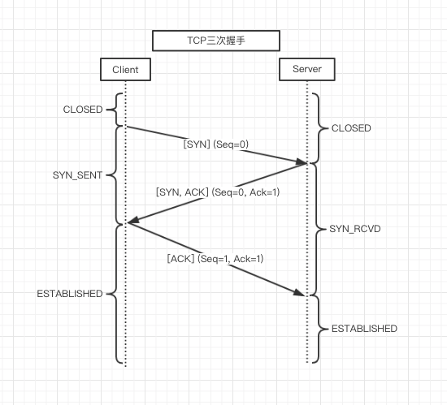

# TCP链接的建立与断开

TCP链接的建立需要三次挥手，而断开需要四次挥手。

## 三次握手

什么是三次握手？如下图

三次握手数据报

三次握手流程、状态转换如图

为什么是三次握手？

第一次握手，C端向S端发送SYN，告诉S端要建立链接。如果只有这一次握手，C端无法确定S端是否收到这个SYN。

第二次握手，S端向C端发送ACK，告诉C端S端收到了它的SYN。如果只有两次握手，S端无法确定C端是否收到了这个ACK。

第三次握手，C端向S端发送ACK，告诉S端收到了它的ACK。这时候C端、S端都已确定到对方的链路是通的。所以S端不再向B端发送ACK，也就没有第四次握手了。

## 四次挥手

什么是四次握手？如下图

四次挥手数据报

四次挥手流程、状态转换如图

为什么是四次挥手？

TCP链接是全双工的，因此每个方向都必须单独进行关闭。

假设断开链接的发起方为A，另一方为B。

第一次挥手，A端向B端发送FIN，告诉B端它不再发送数据了，但是此时A端还可能需要接受A端发来的数据，所以不能在此处断开链接。

第二次挥手，B端向A端发送ACK，告诉A端收到了它的FIN，但是此时B端可能还有数据要向A端发送，所以不能在此处断开链接。

第三次挥手，B端向A端发送FIN，告诉A端我处理完你的请求、该发的数据已全部发给你了、不再向你发送数据了。

第四次挥手，A端向B端发送ACK，告诉B端收到了它的FIN，A端等待2MSL后断开链接。B端收到这个ACK后断开链接。

## 如何触发链接的关闭

对与HTTP，它的头部参数connection可以触发链接的关闭。

具体如下：

如果请求方头部connection值为keep-alive